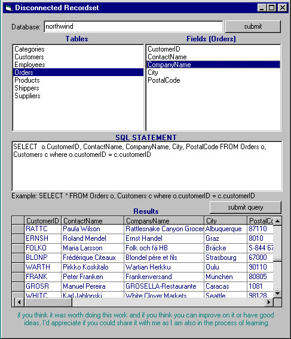



## Disconnected Recordset

### Description

The Vb program attempts a connection to the internet on a server somewhere and returns a disconnected recordset. 

You will need to specify the database name (currently Access databases) but if you modify the asp pages you can also make connection to a SQL Server. It also expects a SQL statement for asp page to execute (when you double click a table name, a default SELECT statement is set). 

The asp pages will return to the VB Client a list of table names for the specified database and a disconnected recordset for the SQL statement. 

You might have to modify the asp page that returns the recordset to return records in groups of say 3000 records at a time if the database is very large. But then since this is just a demonstration and an idea to get started, there is definately lots of work that need to be done to make bug free. Good luck anyway guys. 

I havent done any error trapping so you may have to supply valid SQL statements for your asp pages to execute correctly.
 
### More Info
 

             |
---                |---
**Submitted On**   |2001-05-30 11:44:42
**By**             |[Eshaq Amir](https://github.com/Planet-Source-Code/PSCIndex/blob/master/ByAuthor/eshaq-amir.md)
**Level**          |Intermediate
**User Rating**    |4.7 (14 globes from 3 users)
**Compatibility**  |VB 6\.0, ASP \(Active Server Pages\) , VBA MS Access
**Category**       |[Internet/ HTML](https://github.com/Planet-Source-Code/PSCIndex/blob/master/ByCategory/internet-html__1-34.md)
**World**          |[Visual Basic](https://github.com/Planet-Source-Code/PSCIndex/blob/master/ByWorld/visual-basic.md)
**Archive File**   |[Disconnect202735302001\.zip](https://github.com/Planet-Source-Code/eshaq-amir-disconnected-recordset__1-23589/archive/master.zip)

